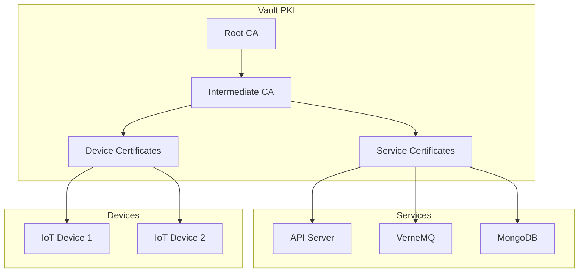

# Security Architecture

TES⩓IoT implements a comprehensive Zero Trust security model that ensures every component and connection is authenticated, authorized, and encrypted.

## Overview

Our security architecture is built on these principles:

1. **Never Trust, Always Verify** - Every request is authenticated
2. **Least Privilege Access** - Minimal permissions by default
3. **Defense in Depth** - Multiple security layers
4. **End-to-End Encryption** - All data encrypted in transit and at rest
5. **Audit Everything** - Comprehensive logging and monitoring

## Core Components

### 1. HashiCorp Vault (Certificate Authority)

Vault serves as our central PKI and secrets management system:



**Key Features:**
- Automatic certificate rotation
- Short-lived certificates (24-hour default)
- Certificate revocation lists (CRL)
- Hardware security module (HSM) support

### 2. Device Authentication

Every device must authenticate using X.509 certificates:

```yaml
# Device certificate requirements
Certificate:
  Subject:
    CN: device-uuid          # Unique device identifier
    O: organization-id       # Organization ownership
    OU: device-type         # Device classification
  Extensions:
    KeyUsage:
      - digitalSignature
      - keyAgreement
    ExtendedKeyUsage:
      - clientAuth
  Validity: 
    Days: 30                # Short-lived for security
```

**Authentication Flow:**
1. Device presents certificate during TLS handshake
2. VerneMQ validates certificate against Vault CA
3. Webhook validates device status in database
4. Connection approved or rejected
5. All attempts logged for audit

### 3. API Security

REST API implements multiple security layers:

#### JWT Token Authentication
```python
# Token structure
{
  "sub": "user-uuid",
  "org": "organization-uuid",
  "roles": ["admin", "operator"],
  "exp": 1234567890,
  "iat": 1234567890,
  "iss": "tesaiot-platform",
  "aud": "api.tesaiot.com"
}
```

#### Rate Limiting
```yaml
RateLimits:
  Anonymous: 10/minute
  Authenticated: 100/minute
  Premium: 1000/minute
  PerEndpoint:
    /api/v1/auth/login: 5/minute
    /api/v1/devices/*/telemetry: 1000/minute
```

#### CORS Configuration
```javascript
CORS: {
  origins: ["https://app.tesaiot.com"],
  methods: ["GET", "POST", "PUT", "DELETE"],
  credentials: true,
  maxAge: 86400
}
```

### 4. Data Encryption

#### In Transit
- TLS 1.3 minimum for all connections
- Perfect Forward Secrecy (PFS)
- Strong cipher suites only:
  ```
  TLS_AES_256_GCM_SHA384
  TLS_CHACHA20_POLY1305_SHA256
  TLS_AES_128_GCM_SHA256
  ```

#### At Rest
- MongoDB: Encrypted storage engine
- TimescaleDB: Transparent data encryption
- File storage: AES-256-GCM
- Backups: Additional encryption layer

### 5. Network Security

#### Zero Trust Network Architecture
```yaml
Networks:
  DMZ:
    - NGINX (Public facing)
    - APISIX Gateway
  
  Application:
    - API Servers
    - VerneMQ Cluster
    - Flowise AI
  
  Data:
    - MongoDB Cluster
    - TimescaleDB
    - Redis Cache
  
  Management:
    - Vault
    - Monitoring
    - Logging
```

#### Firewall Rules
```bash
# Ingress rules (examples)
- Allow 443/tcp from 0.0.0.0/0 to DMZ        # HTTPS
- Allow 8883/tcp from 0.0.0.0/0 to DMZ       # MQTTS
- Allow 5566/tcp from 10.0.0.0/8 to App      # Internal API
- Deny all else

# Egress rules
- Allow established connections
- Allow DNS (53/udp)
- Allow NTP (123/udp)
- Deny all else
```

## Security Policies

### 1. Password Policy
```yaml
PasswordPolicy:
  MinLength: 12
  RequireUppercase: true
  RequireLowercase: true
  RequireNumbers: true
  RequireSpecialChars: true
  MaxAge: 90 days
  History: 5
  MaxAttempts: 5
  LockoutDuration: 30 minutes
```

### 2. Session Management
```yaml
SessionPolicy:
  Timeout: 30 minutes
  AbsoluteTimeout: 8 hours
  ConcurrentSessions: 3
  SecureFlags:
    - HttpOnly
    - Secure
    - SameSite=Strict
```

### 3. API Token Policy
```yaml
APITokenPolicy:
  Types:
    Personal: 
      MaxAge: 90 days
      Scope: user permissions
    Service:
      MaxAge: 365 days
      Scope: specific services
    Temporary:
      MaxAge: 1 hour
      Scope: limited operations
```

## Compliance

### Standards Compliance
- **NIST CSF 2.0** - Cybersecurity Framework
- **ISO 27001** - Information Security Management
- **ISO 27017** - Cloud Security
- **ISO 27018** - PII Protection
- **IEC 62443** - Industrial Security

### Security Controls
```yaml
Controls:
  Access Control:
    - AC-2: Account Management
    - AC-3: Access Enforcement
    - AC-6: Least Privilege
    
  Audit and Accountability:
    - AU-2: Audit Events
    - AU-3: Content of Audit Records
    - AU-4: Audit Storage Capacity
    
  System and Communications:
    - SC-8: Transmission Confidentiality
    - SC-13: Cryptographic Protection
    - SC-23: Session Authenticity
```

## Security Operations

### 1. Monitoring and Detection
```yaml
SecurityMonitoring:
  SIEM: 
    - Failed authentication attempts
    - Privilege escalation
    - Unusual API patterns
    - Certificate anomalies
    
  Alerts:
    Critical:
      - Multiple failed logins
      - Unauthorized access attempts
      - Certificate validation failures
    
    Warning:
      - Unusual traffic patterns
      - Expired certificates
      - High error rates
```

### 2. Incident Response
```yaml
IncidentResponse:
  Phases:
    1. Detection: Automated monitoring
    2. Analysis: Security team review
    3. Containment: Isolate affected systems
    4. Eradication: Remove threat
    5. Recovery: Restore operations
    6. Lessons Learned: Update procedures
    
  SLA:
    Critical: 15 minutes
    High: 1 hour
    Medium: 4 hours
    Low: 24 hours
```

### 3. Security Auditing
```sql
-- Audit log schema
CREATE TABLE security_audit (
    id UUID PRIMARY KEY,
    timestamp TIMESTAMPTZ NOT NULL,
    user_id UUID,
    action VARCHAR(255) NOT NULL,
    resource VARCHAR(255),
    result VARCHAR(50),
    ip_address INET,
    user_agent TEXT,
    details JSONB
);

-- Indexes for efficient querying
CREATE INDEX idx_audit_timestamp ON security_audit(timestamp);
CREATE INDEX idx_audit_user ON security_audit(user_id);
CREATE INDEX idx_audit_action ON security_audit(action);
```

## Best Practices

### For Administrators
1. **Regular Security Reviews**
   - Monthly certificate audit
   - Quarterly access review
   - Annual penetration testing

2. **Patch Management**
   - Critical patches: 24 hours
   - Security patches: 7 days
   - Regular updates: Monthly

3. **Backup Security**
   - Encrypted backups
   - Offsite storage
   - Regular restore testing

### For Developers
1. **Secure Coding**
   ```python
   # Input validation example
   def validate_device_id(device_id: str) -> bool:
       """Validate device ID format and existence"""
       if not re.match(r'^[a-f0-9]{8}-[a-f0-9]{4}-[a-f0-9]{4}-[a-f0-9]{4}-[a-f0-9]{12}$', device_id):
           raise ValueError("Invalid device ID format")
       
       if not device_exists(device_id):
           raise ValueError("Device not found")
       
       return True
   ```

2. **Secret Management**
   ```python
   # Never hardcode secrets
   # Bad
   API_KEY = "sk-1234567890abcdef"
   
   # Good
   API_KEY = os.environ.get('API_KEY')
   # Better
   API_KEY = vault_client.read_secret('api/keys/service')
   ```

3. **Error Handling**
   ```python
   # Don't expose internal details
   # Bad
   except Exception as e:
       return {"error": str(e), "stack": traceback.format_exc()}
   
   # Good
   except ValidationError:
       return {"error": "Invalid input provided"}, 400
   except Exception:
       logger.exception("Unexpected error")
       return {"error": "Internal server error"}, 500
   ```

## Security Roadmap

### Current (v2025.06)
- ✅ Zero Trust MQTT with X.509
- ✅ Vault PKI integration
- ✅ Basic RBAC
- ✅ TLS everywhere

### Next (v2025.07)
- [ ] AI security governance
- [ ] Advanced threat detection
- [ ] Automated security scanning
- [ ] Enhanced audit capabilities

### Future (v2025.09+)
- [ ] Hardware security module (HSM)
- [ ] Quantum-resistant cryptography
- [ ] Behavioral analytics
- [ ] Zero-knowledge proofs

## Resources

- [NIST Cybersecurity Framework](https://www.nist.gov/cyberframework)
- [OWASP IoT Security](https://owasp.org/www-project-internet-of-things/)
- [Vault Documentation](https://www.vaultproject.io/docs)
- [TLS Best Practices](https://github.com/ssllabs/research/wiki/SSL-and-TLS-Deployment-Best-Practices)