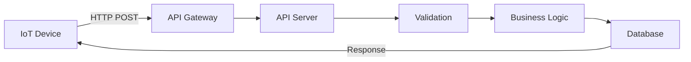

# Building Your First IoT API

In this tutorial, you'll learn how to build a simple IoT API endpoint that receives sensor data and stores it in the database.

## Prerequisites

- TES⩓IoT Platform running locally
- Basic knowledge of Python and REST APIs
- Postman or curl for testing

## What We'll Build

A simple temperature monitoring API that:
- Receives temperature readings from sensors
- Validates the data
- Stores it in the database
- Returns confirmation

## Step 1: Understanding the Architecture

Before we code, let's understand how APIs work in TES⩓IoT:



## Step 2: Create the Data Model

First, let's define what temperature data looks like:

```python
# app/models/temperature.py
from pydantic import BaseModel, Field, validator
from datetime import datetime
from typing import Optional

class TemperatureReading(BaseModel):
    """Model for temperature sensor readings."""
    
    device_id: str = Field(..., description="Unique device identifier")
    temperature: float = Field(..., ge=-50, le=100, description="Temperature in Celsius")
    humidity: Optional[float] = Field(None, ge=0, le=100, description="Humidity percentage")
    timestamp: Optional[datetime] = Field(None, description="Reading timestamp")
    
    @validator('temperature')
    def validate_temperature(cls, v):
        """Ensure temperature is realistic."""
        if v < -50 or v > 100:
            raise ValueError('Temperature must be between -50°C and 100°C')
        return round(v, 2)  # Round to 2 decimal places
    
    @validator('timestamp', pre=True, always=True)
    def set_timestamp(cls, v):
        """Set current timestamp if not provided."""
        return v or datetime.utcnow()
    
    class Config:
        schema_extra = {
            "example": {
                "device_id": "temp_sensor_001",
                "temperature": 22.5,
                "humidity": 45.2,
                "timestamp": "2025-06-15T10:30:00Z"
            }
        }
```

## Step 3: Create the Service Layer

The service layer handles business logic:

```python
# app/services/temperature_service.py
from typing import List, Optional
from datetime import datetime, timedelta
from sqlalchemy.orm import Session

from app.models.temperature import TemperatureReading
from app.repositories.temperature_repository import TemperatureRepository
from app.core.exceptions import ValidationException

class TemperatureService:
    """Service for handling temperature data."""
    
    def __init__(self, db: Session):
        self.db = db
        self.repository = TemperatureRepository(db)
    
    async def record_temperature(
        self, 
        reading: TemperatureReading,
        user_id: str
    ) -> dict:
        """
        Record a new temperature reading.
        
        Args:
            reading: Temperature data from sensor
            user_id: ID of user recording the data
            
        Returns:
            dict: Confirmation with reading ID
        """
        # Check if device belongs to user
        if not self._verify_device_ownership(reading.device_id, user_id):
            raise ValidationException(
                field="device_id",
                reason="Device not found or access denied"
            )
        
        # Check for duplicate readings (anti-replay)
        if self._is_duplicate_reading(reading):
            raise ValidationException(
                field="timestamp",
                reason="Duplicate reading detected"
            )
        
        # Check if temperature changed drastically (anomaly detection)
        if self._is_anomalous_reading(reading):
            # Log potential sensor malfunction
            logger.warning(
                f"Anomalous reading from device {reading.device_id}: {reading.temperature}°C"
            )
        
        # Store in database
        stored_reading = self.repository.create(reading.dict())
        
        # Update device last_seen timestamp
        self._update_device_status(reading.device_id)
        
        return {
            "success": True,
            "reading_id": str(stored_reading.id),
            "message": "Temperature recorded successfully"
        }
    
    def _verify_device_ownership(self, device_id: str, user_id: str) -> bool:
        """Verify that device belongs to user's organization."""
        # Implementation here
        return True
    
    def _is_duplicate_reading(self, reading: TemperatureReading) -> bool:
        """Check if this exact reading was already submitted."""
        recent_readings = self.repository.get_recent_readings(
            device_id=reading.device_id,
            minutes=5
        )
        
        for recent in recent_readings:
            if (recent.temperature == reading.temperature and 
                abs((recent.timestamp - reading.timestamp).total_seconds()) < 60):
                return True
        
        return False
    
    def _is_anomalous_reading(self, reading: TemperatureReading) -> bool:
        """Detect anomalous temperature changes."""
        last_reading = self.repository.get_last_reading(reading.device_id)
        
        if not last_reading:
            return False
        
        # If temperature changed more than 10°C in 1 minute
        time_diff = (reading.timestamp - last_reading.timestamp).total_seconds()
        temp_diff = abs(reading.temperature - last_reading.temperature)
        
        if time_diff < 60 and temp_diff > 10:
            return True
        
        return False
```

## Step 4: Create the API Endpoint

Now let's create the FastAPI endpoint:

```python
# app/api/v1/endpoints/temperature.py
from fastapi import APIRouter, Depends, HTTPException, status
from typing import List
from sqlalchemy.orm import Session

from app.models.temperature import TemperatureReading
from app.services.temperature_service import TemperatureService
from app.core.deps import get_current_user, get_db
from app.core.responses import SuccessResponse, ErrorResponse

router = APIRouter()

@router.post(
    "/temperature",
    response_model=SuccessResponse,
    status_code=status.HTTP_201_CREATED,
    summary="Record temperature reading",
    description="Submit a new temperature reading from an IoT device"
)
async def record_temperature(
    reading: TemperatureReading,
    current_user = Depends(get_current_user),
    db: Session = Depends(get_db)
):
    """
    Record a new temperature reading.
    
    - **device_id**: Unique identifier of the temperature sensor
    - **temperature**: Temperature value in Celsius (-50 to 100)
    - **humidity**: Optional humidity percentage (0 to 100)
    - **timestamp**: Optional ISO 8601 timestamp (defaults to current time)
    """
    try:
        service = TemperatureService(db)
        result = await service.record_temperature(reading, current_user.id)
        
        return SuccessResponse(
            data=result,
            message="Temperature recorded successfully"
        )
        
    except ValidationException as e:
        raise HTTPException(
            status_code=status.HTTP_400_BAD_REQUEST,
            detail={
                "error": "VALIDATION_ERROR",
                "field": e.field,
                "reason": e.reason
            }
        )
    except Exception as e:
        logger.exception("Error recording temperature")
        raise HTTPException(
            status_code=status.HTTP_500_INTERNAL_SERVER_ERROR,
            detail="Internal server error"
        )

@router.get(
    "/temperature/{device_id}/latest",
    response_model=TemperatureReading,
    summary="Get latest temperature",
    description="Retrieve the most recent temperature reading for a device"
)
async def get_latest_temperature(
    device_id: str,
    current_user = Depends(get_current_user),
    db: Session = Depends(get_db)
):
    """Get the latest temperature reading for a specific device."""
    service = TemperatureService(db)
    
    # Verify device access
    if not service._verify_device_ownership(device_id, current_user.id):
        raise HTTPException(
            status_code=status.HTTP_404_NOT_FOUND,
            detail="Device not found"
        )
    
    reading = service.repository.get_last_reading(device_id)
    if not reading:
        raise HTTPException(
            status_code=status.HTTP_404_NOT_FOUND,
            detail="No readings found for this device"
        )
    
    return reading

@router.get(
    "/temperature/{device_id}/history",
    response_model=List[TemperatureReading],
    summary="Get temperature history",
    description="Retrieve historical temperature readings for a device"
)
async def get_temperature_history(
    device_id: str,
    hours: int = 24,
    current_user = Depends(get_current_user),
    db: Session = Depends(get_db)
):
    """
    Get temperature history for a device.
    
    - **device_id**: Device to query
    - **hours**: Number of hours of history (default: 24, max: 168)
    """
    if hours > 168:  # Max 1 week
        hours = 168
    
    service = TemperatureService(db)
    
    # Verify device access
    if not service._verify_device_ownership(device_id, current_user.id):
        raise HTTPException(
            status_code=status.HTTP_404_NOT_FOUND,
            detail="Device not found"
        )
    
    readings = service.repository.get_readings_since(
        device_id=device_id,
        since=datetime.utcnow() - timedelta(hours=hours)
    )
    
    return readings
```

## Step 5: Add the Route to Main App

Register your new router in the main application:

```python
# app/api/v1/api.py
from fastapi import APIRouter
from app.api.v1.endpoints import temperature

api_router = APIRouter()

api_router.include_router(
    temperature.router,
    prefix="/devices",
    tags=["temperature"]
)
```

## Step 6: Test Your API

### Using curl

```bash
# Get authentication token
TOKEN=$(curl -X POST http://localhost:5566/api/v1/auth/login \
  -H "Content-Type: application/json" \
  -d '{"email":"admin@tesa.local","password":"admin123"}' \
  | jq -r '.access_token')

# Submit temperature reading
curl -X POST http://localhost:5566/api/v1/devices/temperature \
  -H "Authorization: Bearer $TOKEN" \
  -H "Content-Type: application/json" \
  -d '{
    "device_id": "temp_sensor_001",
    "temperature": 23.5,
    "humidity": 45.2
  }'

# Get latest reading
curl -X GET http://localhost:5566/api/v1/devices/temperature/temp_sensor_001/latest \
  -H "Authorization: Bearer $TOKEN"

# Get history
curl -X GET http://localhost:5566/api/v1/devices/temperature/temp_sensor_001/history?hours=24 \
  -H "Authorization: Bearer $TOKEN"
```

### Using Python

```python
import requests
import json

# Configuration
BASE_URL = "http://localhost:5566/api/v1"
EMAIL = "admin@tesa.local"
PASSWORD = "admin123"

# Login
login_response = requests.post(
    f"{BASE_URL}/auth/login",
    json={"email": EMAIL, "password": PASSWORD}
)
token = login_response.json()["access_token"]

# Headers with auth
headers = {
    "Authorization": f"Bearer {token}",
    "Content-Type": "application/json"
}

# Submit reading
reading = {
    "device_id": "temp_sensor_001",
    "temperature": 23.5,
    "humidity": 45.2
}

response = requests.post(
    f"{BASE_URL}/devices/temperature",
    headers=headers,
    json=reading
)

print(f"Response: {response.json()}")

# Get history
history = requests.get(
    f"{BASE_URL}/devices/temperature/temp_sensor_001/history",
    headers=headers,
    params={"hours": 24}
)

print(f"History: {json.dumps(history.json(), indent=2)}")
```

## Step 7: Add Input Validation

Let's add more sophisticated validation:

```python
# app/api/v1/endpoints/temperature.py

from app.core.rate_limit import rate_limit

@router.post(
    "/temperature/batch",
    response_model=SuccessResponse,
    status_code=status.HTTP_201_CREATED,
    dependencies=[Depends(rate_limit(calls=10, period=60))]  # 10 calls per minute
)
async def record_temperature_batch(
    readings: List[TemperatureReading],
    current_user = Depends(get_current_user),
    db: Session = Depends(get_db)
):
    """
    Submit multiple temperature readings at once.
    
    Maximum 100 readings per request.
    """
    if len(readings) > 100:
        raise HTTPException(
            status_code=status.HTTP_400_BAD_REQUEST,
            detail="Maximum 100 readings per batch"
        )
    
    # Validate all readings are from same organization
    device_ids = {r.device_id for r in readings}
    
    service = TemperatureService(db)
    for device_id in device_ids:
        if not service._verify_device_ownership(device_id, current_user.id):
            raise HTTPException(
                status_code=status.HTTP_403_FORBIDDEN,
                detail=f"Access denied for device {device_id}"
            )
    
    # Process readings
    results = []
    errors = []
    
    for reading in readings:
        try:
            result = await service.record_temperature(reading, current_user.id)
            results.append(result)
        except Exception as e:
            errors.append({
                "device_id": reading.device_id,
                "timestamp": reading.timestamp.isoformat(),
                "error": str(e)
            })
    
    return SuccessResponse(
        data={
            "processed": len(results),
            "failed": len(errors),
            "errors": errors if errors else None
        }
    )
```

## Step 8: Add Monitoring

Add logging and metrics:

```python
# app/api/v1/endpoints/temperature.py
from app.core.metrics import metrics_collector

@router.post("/temperature")
async def record_temperature(
    reading: TemperatureReading,
    current_user = Depends(get_current_user),
    db: Session = Depends(get_db)
):
    # Track API call
    metrics_collector.increment(
        "api.temperature.submissions",
        tags={"device_type": "temperature_sensor"}
    )
    
    start_time = time.time()
    
    try:
        # ... existing code ...
        
        # Track success
        metrics_collector.increment("api.temperature.success")
        
        # Track temperature values for monitoring
        metrics_collector.gauge(
            "iot.temperature.value",
            reading.temperature,
            tags={"device_id": reading.device_id}
        )
        
        return response
        
    except Exception as e:
        # Track errors
        metrics_collector.increment(
            "api.temperature.errors",
            tags={"error_type": type(e).__name__}
        )
        raise
    
    finally:
        # Track response time
        duration = time.time() - start_time
        metrics_collector.histogram(
            "api.temperature.response_time",
            duration
        )
```

## Best Practices Learned

1. **Always Validate Input**: Use Pydantic models for automatic validation
2. **Handle Errors Gracefully**: Return meaningful error messages
3. **Use Dependency Injection**: For database sessions and authentication
4. **Implement Rate Limiting**: Protect your API from abuse
5. **Log Everything**: But don't log sensitive data
6. **Test Your API**: Write unit and integration tests
7. **Document Your Endpoints**: Use FastAPI's automatic documentation

## Next Steps

- [Add WebSocket support](../intermediate/websocket-api.md) for real-time updates
- [Implement caching](../intermediate/caching-strategies.md) for better performance
- [Add data visualization](../intermediate/data-visualization.md) for temperature trends
- [Create alerts](../advanced/alerting-system.md) for temperature thresholds

## Complete Code

The complete code for this tutorial is available in the [examples repository](https://github.com/tesaiot/examples/tree/main/tutorials/temperature-api).

## Troubleshooting

### Common Issues

1. **401 Unauthorized**: Check your authentication token
2. **422 Validation Error**: Verify your JSON payload format
3. **500 Internal Error**: Check server logs for details
4. **Rate Limit Exceeded**: Wait before making more requests

### Getting Help

- Check the [API Reference](../../api-reference/rest-api.md)
- Visit our [Community Forum](https://forum.tesaiot.com)
- Report bugs on [GitHub](https://github.com/tesaiot/tesa-iot-platform/issues)